# Uber Data Analysis
## Uber Pickups Numbers in New York City 
## Xiaodan Chen 
## 2021-10-14

### Importing the Essential Packages


```python
import pandas as pd
import numpy as np
import matplotlib.pyplot as plt
import seaborn as sns
```

### Reading Data


```python
uber_df = pd.read_csv('/Users/dani/Desktop/Python_Project/Uber/uber_dataset.csv')
```


```python
uber_df.tail(5)
```


<div>
<style scoped>
    .dataframe tbody tr th:only-of-type {
        vertical-align: middle;
    }

    .dataframe tbody tr th {
        vertical-align: top;
    }

    .dataframe thead th {
        text-align: right;
    }
</style>
<table border="1" class="dataframe">
  <thead>
    <tr style="text-align: right;">
      <th></th>
      <th>Unnamed: 0</th>
      <th>Date.Time</th>
      <th>Lat</th>
      <th>Lon</th>
      <th>Base</th>
      <th>Time</th>
      <th>day</th>
      <th>month</th>
      <th>year</th>
      <th>dayofweek</th>
      <th>hour</th>
      <th>minute</th>
      <th>second</th>
    </tr>
  </thead>
  <tbody>
    <tr>
      <th>4534322</th>
      <td>4534323</td>
      <td>2014-09-30 22:57:00</td>
      <td>40.7668</td>
      <td>-73.9845</td>
      <td>B02764</td>
      <td>22:57:00</td>
      <td>30</td>
      <td>Sep</td>
      <td>2014</td>
      <td>Tue</td>
      <td>22</td>
      <td>57</td>
      <td>0</td>
    </tr>
    <tr>
      <th>4534323</th>
      <td>4534324</td>
      <td>2014-09-30 22:57:00</td>
      <td>40.6911</td>
      <td>-74.1773</td>
      <td>B02764</td>
      <td>22:57:00</td>
      <td>30</td>
      <td>Sep</td>
      <td>2014</td>
      <td>Tue</td>
      <td>22</td>
      <td>57</td>
      <td>0</td>
    </tr>
    <tr>
      <th>4534324</th>
      <td>4534325</td>
      <td>2014-09-30 22:58:00</td>
      <td>40.8519</td>
      <td>-73.9319</td>
      <td>B02764</td>
      <td>22:58:00</td>
      <td>30</td>
      <td>Sep</td>
      <td>2014</td>
      <td>Tue</td>
      <td>22</td>
      <td>58</td>
      <td>0</td>
    </tr>
    <tr>
      <th>4534325</th>
      <td>4534326</td>
      <td>2014-09-30 22:58:00</td>
      <td>40.7081</td>
      <td>-74.0066</td>
      <td>B02764</td>
      <td>22:58:00</td>
      <td>30</td>
      <td>Sep</td>
      <td>2014</td>
      <td>Tue</td>
      <td>22</td>
      <td>58</td>
      <td>0</td>
    </tr>
    <tr>
      <th>4534326</th>
      <td>4534327</td>
      <td>2014-09-30 22:58:00</td>
      <td>40.7140</td>
      <td>-73.9496</td>
      <td>B02764</td>
      <td>22:58:00</td>
      <td>30</td>
      <td>Sep</td>
      <td>2014</td>
      <td>Tue</td>
      <td>22</td>
      <td>58</td>
      <td>0</td>
    </tr>
  </tbody>
</table>
</div>


### Data Structure

This dataset contains more than 4.5 millions observations and 13 columns.


```python
uber_df.shape
```


    (4534327, 13)


```python
uber_df.info()
```

    <class 'pandas.core.frame.DataFrame'>
    RangeIndex: 4534327 entries, 0 to 4534326
    Data columns (total 13 columns):
     #   Column      Dtype  
    ---  ------      -----  
     0   Unnamed: 0  int64  
     1   Date.Time   object 
     2   Lat         float64
     3   Lon         float64
     4   Base        object 
     5   Time        object 
     6   day         int64  
     7   month       object 
     8   year        int64  
     9   dayofweek   object 
     10  hour        int64  
     11  minute      int64  
     12  second      int64  
    dtypes: float64(2), int64(6), object(5)
    memory usage: 449.7+ MB


### Checking any Missing Values


```python
uber_df.isnull().values.any()
```


    False


### Number of Trips in a Day

The number of trips that the passengers made in a day, showing the number of passengers fares throughout the day. 


```python
hour = uber_df['hour']
hour_df = hour.value_counts()
hour_df
```


    17    336190
    18    324679
    16    313400
    19    294513
    20    284604
    21    281460
    15    275466
    22    241858
    14    230625
    13    195877
    7     193094
    8     190504
    12    170452
    23    169190
    11    165703
    9     159967
    10    159148
    6     143213
    0     103836
    5      83939
    1      67227
    4      55230
    3      48287
    2      45865
    Name: hour, dtype: int64


The number of trips are higher in the evening around 5:00 and 6:00 PM. 


```python
fig, ax = plt.subplots()
sns.countplot(data=uber_df, x = 'hour')
ax.set(title = 'Number of Trips in a Day')
```


    [Text(0.5, 1.0, 'Number of Trips in a Day')]


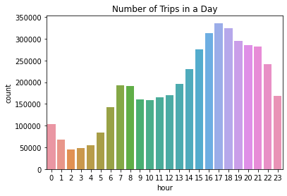


### Number of Trips during Every Day of the Month

The result shows the 30th of the month had the higest trips in the year. 


```python
day = uber_df['day']
day_df = day.value_counts()
day_df
```


    30    167160
    12    160606
    16    158921
    13    156892
    23    156032
    9     155135
    15    153726
    26    153405
    19    153088
    25    152667
    17    152524
    10    152500
    18    151319
    29    149086
    11    148860
    5     147054
    22    146952
    8     145984
    27    145652
    20    144179
    24    144169
    7     143503
    2     143201
    3     142983
    28    141157
    21    141112
    4     140923
    14    140148
    6     139886
    1     127430
    31     78073
    Name: day, dtype: int64


```python
fig, ax = plt.subplots()
sns.countplot(data=uber_df, x = 'day')
ax.set(title = 'Number of Trips During Every day of the Month')
```


    [Text(0.5, 1.0, 'Number of Trips During Every day of the Month')]


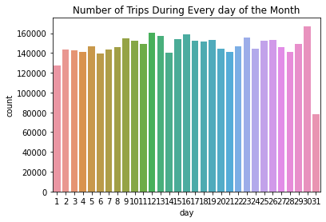


### Number of Trips on Every Day of the Week


```python
week = uber_df['dayofweek']
week_df = week.value_counts()
week_df
```


    Thu    755145
    Fri    741139
    Wed    696488
    Tue    663789
    Sat    646114
    Mon    541472
    Sun    490180
    Name: dayofweek, dtype: int64


```python
fig, ax = plt.subplots()
sns.countplot(data=uber_df, x = 'dayofweek')
ax.set(title = 'Number of Trips on Every Day of the Week')
```


    [Text(0.5, 1.0, 'Number of Trips on Every Day of the Week')]


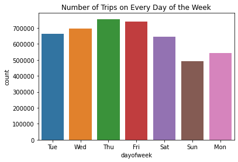


```python
month = uber_df['month']
month_df = month.value_counts()
month_df
```


    Sep    1028136
    Aug     829275
    Jul     796121
    Jun     663844
    May     652435
    Apr     564516
    Name: month, dtype: int64


### Number of Trips Taking Place during Months in a Year


```python
fig, ax = plt.subplots()
sns.countplot(data = uber_df, x = 'month')
ax.set(title = 'Number of Trips During Months in a Year')
```


    [Text(0.5, 1.0, 'Number of Trips During Months in a Year')]


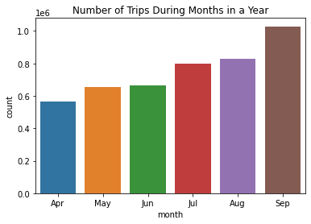


```python
week_month = uber_df[['month', 'dayofweek', 'Date.Time']]
week_month = week_month.groupby(['month', 'dayofweek']).agg('count')
week_month
```


<div>
<style scoped>
    .dataframe tbody tr th:only-of-type {
        vertical-align: middle;
    }

    .dataframe tbody tr th {
        vertical-align: top;
    }

    .dataframe thead th {
        text-align: right;
    }
</style>
<table border="1" class="dataframe">
  <thead>
    <tr style="text-align: right;">
      <th></th>
      <th></th>
      <th>Date.Time</th>
    </tr>
    <tr>
      <th>month</th>
      <th>dayofweek</th>
      <th></th>
    </tr>
  </thead>
  <tbody>
    <tr>
      <th rowspan="7" valign="top">Apr</th>
      <th>Fri</th>
      <td>90303</td>
    </tr>
    <tr>
      <th>Mon</th>
      <td>60861</td>
    </tr>
    <tr>
      <th>Sat</th>
      <td>77218</td>
    </tr>
    <tr>
      <th>Sun</th>
      <td>51251</td>
    </tr>
    <tr>
      <th>Thu</th>
      <td>85067</td>
    </tr>
    <tr>
      <th>Tue</th>
      <td>91185</td>
    </tr>
    <tr>
      <th>Wed</th>
      <td>108631</td>
    </tr>
    <tr>
      <th rowspan="7" valign="top">Aug</th>
      <th>Fri</th>
      <td>148674</td>
    </tr>
    <tr>
      <th>Mon</th>
      <td>91633</td>
    </tr>
    <tr>
      <th>Sat</th>
      <td>132225</td>
    </tr>
    <tr>
      <th>Sun</th>
      <td>110246</td>
    </tr>
    <tr>
      <th>Thu</th>
      <td>124117</td>
    </tr>
    <tr>
      <th>Tue</th>
      <td>107124</td>
    </tr>
    <tr>
      <th>Wed</th>
      <td>115256</td>
    </tr>
    <tr>
      <th rowspan="7" valign="top">Jul</th>
      <th>Fri</th>
      <td>102735</td>
    </tr>
    <tr>
      <th>Mon</th>
      <td>93189</td>
    </tr>
    <tr>
      <th>Sat</th>
      <td>90260</td>
    </tr>
    <tr>
      <th>Sun</th>
      <td>76327</td>
    </tr>
    <tr>
      <th>Thu</th>
      <td>148439</td>
    </tr>
    <tr>
      <th>Tue</th>
      <td>137454</td>
    </tr>
    <tr>
      <th>Wed</th>
      <td>147717</td>
    </tr>
    <tr>
      <th rowspan="7" valign="top">Jun</th>
      <th>Fri</th>
      <td>105056</td>
    </tr>
    <tr>
      <th>Mon</th>
      <td>94655</td>
    </tr>
    <tr>
      <th>Sat</th>
      <td>81364</td>
    </tr>
    <tr>
      <th>Sun</th>
      <td>79656</td>
    </tr>
    <tr>
      <th>Thu</th>
      <td>115325</td>
    </tr>
    <tr>
      <th>Tue</th>
      <td>88134</td>
    </tr>
    <tr>
      <th>Wed</th>
      <td>99654</td>
    </tr>
    <tr>
      <th rowspan="7" valign="top">May</th>
      <th>Fri</th>
      <td>133991</td>
    </tr>
    <tr>
      <th>Mon</th>
      <td>63846</td>
    </tr>
    <tr>
      <th>Sat</th>
      <td>102990</td>
    </tr>
    <tr>
      <th>Sun</th>
      <td>56168</td>
    </tr>
    <tr>
      <th>Thu</th>
      <td>128921</td>
    </tr>
    <tr>
      <th>Tue</th>
      <td>76662</td>
    </tr>
    <tr>
      <th>Wed</th>
      <td>89857</td>
    </tr>
    <tr>
      <th rowspan="7" valign="top">Sep</th>
      <th>Fri</th>
      <td>160380</td>
    </tr>
    <tr>
      <th>Mon</th>
      <td>137288</td>
    </tr>
    <tr>
      <th>Sat</th>
      <td>162057</td>
    </tr>
    <tr>
      <th>Sun</th>
      <td>116532</td>
    </tr>
    <tr>
      <th>Thu</th>
      <td>153276</td>
    </tr>
    <tr>
      <th>Tue</th>
      <td>163230</td>
    </tr>
    <tr>
      <th>Wed</th>
      <td>135373</td>
    </tr>
  </tbody>
</table>
</div>


### Number of Trips on Day of Week during Months


```python
fig, ax = plt.subplots()
sns.countplot(x='month', data = uber_df, hue = 'dayofweek')
ax.set(title = 'Number of Trips on Day of Week during Months')
plt.legend(bbox_to_anchor=(1.05, 1), loc=2, borderaxespad=0.)
```


    <matplotlib.legend.Legend at 0x7fa95231be10>


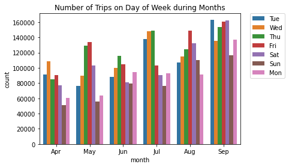


```python
week_month = week_month.pivot_table(index='month', columns='dayofweek', values='Date.Time')
week_month
```


<div>
<style scoped>
    .dataframe tbody tr th:only-of-type {
        vertical-align: middle;
    }

    .dataframe tbody tr th {
        vertical-align: top;
    }

    .dataframe thead th {
        text-align: right;
    }
</style>
<table border="1" class="dataframe">
  <thead>
    <tr style="text-align: right;">
      <th>dayofweek</th>
      <th>Fri</th>
      <th>Mon</th>
      <th>Sat</th>
      <th>Sun</th>
      <th>Thu</th>
      <th>Tue</th>
      <th>Wed</th>
    </tr>
    <tr>
      <th>month</th>
      <th></th>
      <th></th>
      <th></th>
      <th></th>
      <th></th>
      <th></th>
      <th></th>
    </tr>
  </thead>
  <tbody>
    <tr>
      <th>Apr</th>
      <td>90303</td>
      <td>60861</td>
      <td>77218</td>
      <td>51251</td>
      <td>85067</td>
      <td>91185</td>
      <td>108631</td>
    </tr>
    <tr>
      <th>Aug</th>
      <td>148674</td>
      <td>91633</td>
      <td>132225</td>
      <td>110246</td>
      <td>124117</td>
      <td>107124</td>
      <td>115256</td>
    </tr>
    <tr>
      <th>Jul</th>
      <td>102735</td>
      <td>93189</td>
      <td>90260</td>
      <td>76327</td>
      <td>148439</td>
      <td>137454</td>
      <td>147717</td>
    </tr>
    <tr>
      <th>Jun</th>
      <td>105056</td>
      <td>94655</td>
      <td>81364</td>
      <td>79656</td>
      <td>115325</td>
      <td>88134</td>
      <td>99654</td>
    </tr>
    <tr>
      <th>May</th>
      <td>133991</td>
      <td>63846</td>
      <td>102990</td>
      <td>56168</td>
      <td>128921</td>
      <td>76662</td>
      <td>89857</td>
    </tr>
    <tr>
      <th>Sep</th>
      <td>160380</td>
      <td>137288</td>
      <td>162057</td>
      <td>116532</td>
      <td>153276</td>
      <td>163230</td>
      <td>135373</td>
    </tr>
  </tbody>
</table>
</div>


```python
week_month.plot(kind='bar', stacked=True)
plt.legend(bbox_to_anchor=(1.05, 1), loc=2, borderaxespad=0.)
plt.show()
```


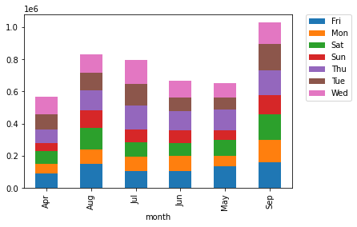


### Number of Trips on Day during Months


```python
fig, ax = plt.subplots()
sns.countplot(x='month', data = uber_df, hue = 'day')
ax.set(title = 'Number of Trips on Day during Months')
plt.legend(bbox_to_anchor=(1.05, 1), loc=2, borderaxespad=0., ncol=4)
```


    <matplotlib.legend.Legend at 0x7fa972956a10>


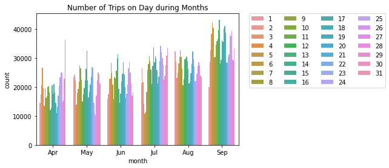


```python
day_mon = uber_df[['month', 'day', 'Date.Time']]
day_mon = day_mon.groupby(['month', 'day']).agg('count')
day_month = day_mon.pivot_table(index='day', columns='month', values='Date.Time')
mon_day = day_mon.pivot_table(index='month', columns='day', values='Date.Time')
mon_day
```


<div>
<style scoped>
    .dataframe tbody tr th:only-of-type {
        vertical-align: middle;
    }

    .dataframe tbody tr th {
        vertical-align: top;
    }

    .dataframe thead th {
        text-align: right;
    }
</style>
<table border="1" class="dataframe">
  <thead>
    <tr style="text-align: right;">
      <th>day</th>
      <th>1</th>
      <th>2</th>
      <th>3</th>
      <th>4</th>
      <th>5</th>
      <th>6</th>
      <th>7</th>
      <th>8</th>
      <th>9</th>
      <th>10</th>
      <th>...</th>
      <th>22</th>
      <th>23</th>
      <th>24</th>
      <th>25</th>
      <th>26</th>
      <th>27</th>
      <th>28</th>
      <th>29</th>
      <th>30</th>
      <th>31</th>
    </tr>
    <tr>
      <th>month</th>
      <th></th>
      <th></th>
      <th></th>
      <th></th>
      <th></th>
      <th></th>
      <th></th>
      <th></th>
      <th></th>
      <th></th>
      <th></th>
      <th></th>
      <th></th>
      <th></th>
      <th></th>
      <th></th>
      <th></th>
      <th></th>
      <th></th>
      <th></th>
      <th></th>
    </tr>
  </thead>
  <tbody>
    <tr>
      <th>Apr</th>
      <td>14546.0</td>
      <td>17474.0</td>
      <td>20701.0</td>
      <td>26714.0</td>
      <td>19521.0</td>
      <td>13445.0</td>
      <td>19550.0</td>
      <td>16188.0</td>
      <td>16843.0</td>
      <td>20041.0</td>
      <td>...</td>
      <td>16975.0</td>
      <td>20346.0</td>
      <td>23352.0</td>
      <td>25095.0</td>
      <td>24925.0</td>
      <td>14677.0</td>
      <td>15475.0</td>
      <td>22835.0</td>
      <td>36251.0</td>
      <td>NaN</td>
    </tr>
    <tr>
      <th>Aug</th>
      <td>32353.0</td>
      <td>28678.0</td>
      <td>23146.0</td>
      <td>24952.0</td>
      <td>28094.0</td>
      <td>30495.0</td>
      <td>32759.0</td>
      <td>30411.0</td>
      <td>26286.0</td>
      <td>20584.0</td>
      <td>...</td>
      <td>29512.0</td>
      <td>27097.0</td>
      <td>22036.0</td>
      <td>22093.0</td>
      <td>24550.0</td>
      <td>27018.0</td>
      <td>28597.0</td>
      <td>27424.0</td>
      <td>23930.0</td>
      <td>23271.0</td>
    </tr>
    <tr>
      <th>Jul</th>
      <td>21228.0</td>
      <td>26480.0</td>
      <td>21597.0</td>
      <td>14148.0</td>
      <td>10890.0</td>
      <td>11443.0</td>
      <td>18280.0</td>
      <td>25763.0</td>
      <td>27817.0</td>
      <td>30541.0</td>
      <td>...</td>
      <td>29029.0</td>
      <td>34073.0</td>
      <td>32050.0</td>
      <td>29975.0</td>
      <td>27708.0</td>
      <td>22590.0</td>
      <td>23981.0</td>
      <td>27589.0</td>
      <td>30740.0</td>
      <td>33541.0</td>
    </tr>
    <tr>
      <th>Jun</th>
      <td>15967.0</td>
      <td>17503.0</td>
      <td>22674.0</td>
      <td>22831.0</td>
      <td>28371.0</td>
      <td>24683.0</td>
      <td>20889.0</td>
      <td>15749.0</td>
      <td>23244.0</td>
      <td>22874.0</td>
      <td>...</td>
      <td>16322.0</td>
      <td>17735.0</td>
      <td>20779.0</td>
      <td>26460.0</td>
      <td>28516.0</td>
      <td>24895.0</td>
      <td>21208.0</td>
      <td>17107.0</td>
      <td>18395.0</td>
      <td>NaN</td>
    </tr>
    <tr>
      <th>May</th>
      <td>23375.0</td>
      <td>24235.0</td>
      <td>22234.0</td>
      <td>13918.0</td>
      <td>17859.0</td>
      <td>19300.0</td>
      <td>21891.0</td>
      <td>27513.0</td>
      <td>26385.0</td>
      <td>22550.0</td>
      <td>...</td>
      <td>26802.0</td>
      <td>26465.0</td>
      <td>14651.0</td>
      <td>10841.0</td>
      <td>10202.0</td>
      <td>17004.0</td>
      <td>22240.0</td>
      <td>24930.0</td>
      <td>24413.0</td>
      <td>21261.0</td>
    </tr>
    <tr>
      <th>Sep</th>
      <td>19961.0</td>
      <td>28831.0</td>
      <td>32631.0</td>
      <td>38360.0</td>
      <td>42319.0</td>
      <td>40520.0</td>
      <td>30134.0</td>
      <td>30360.0</td>
      <td>34560.0</td>
      <td>35910.0</td>
      <td>...</td>
      <td>28312.0</td>
      <td>30316.0</td>
      <td>31301.0</td>
      <td>38203.0</td>
      <td>37504.0</td>
      <td>39468.0</td>
      <td>29656.0</td>
      <td>29201.0</td>
      <td>33431.0</td>
      <td>NaN</td>
    </tr>
  </tbody>
</table>
<p>6 rows × 31 columns</p>
</div>


```python
day_month.plot(kind='bar', stacked=True)
plt.legend(bbox_to_anchor=(1.05, 1), loc=2, borderaxespad=0.)
plt.show()
```


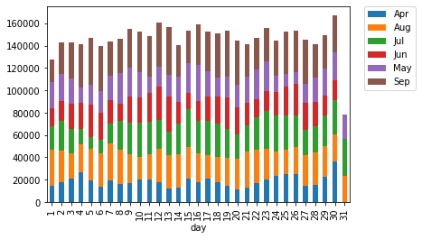


### Number of Trips in Hour during Months


```python
fig, ax = plt.subplots()
sns.countplot(x='month', data = uber_df, hue = 'hour')
ax.set(title = 'Number of Trips in Hour during Months')
plt.legend(bbox_to_anchor=(1.05, 1), loc=2, borderaxespad=0., ncol=2)
```


    <matplotlib.legend.Legend at 0x7fa952b1f990>


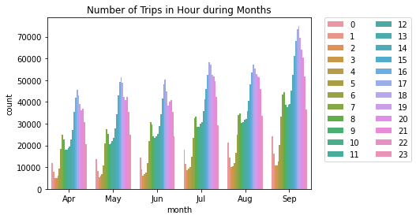


```python
hour_mon = uber_df[['month', 'hour', 'Date.Time']]
hour_mon = hour_mon.groupby(['month', 'hour']).agg('count')
hour_month = hour_mon.pivot_table(index='hour', columns='month', values='Date.Time')
month_hour = hour_mon.pivot_table(index='month', columns='hour', values='Date.Time')
month_hour
```


<div>
<style scoped>
    .dataframe tbody tr th:only-of-type {
        vertical-align: middle;
    }

    .dataframe tbody tr th {
        vertical-align: top;
    }

    .dataframe thead th {
        text-align: right;
    }
</style>
<table border="1" class="dataframe">
  <thead>
    <tr style="text-align: right;">
      <th>hour</th>
      <th>0</th>
      <th>1</th>
      <th>2</th>
      <th>3</th>
      <th>4</th>
      <th>5</th>
      <th>6</th>
      <th>7</th>
      <th>8</th>
      <th>9</th>
      <th>...</th>
      <th>14</th>
      <th>15</th>
      <th>16</th>
      <th>17</th>
      <th>18</th>
      <th>19</th>
      <th>20</th>
      <th>21</th>
      <th>22</th>
      <th>23</th>
    </tr>
    <tr>
      <th>month</th>
      <th></th>
      <th></th>
      <th></th>
      <th></th>
      <th></th>
      <th></th>
      <th></th>
      <th></th>
      <th></th>
      <th></th>
      <th></th>
      <th></th>
      <th></th>
      <th></th>
      <th></th>
      <th></th>
      <th></th>
      <th></th>
      <th></th>
      <th></th>
      <th></th>
    </tr>
  </thead>
  <tbody>
    <tr>
      <th>Apr</th>
      <td>11910</td>
      <td>7769</td>
      <td>4935</td>
      <td>5040</td>
      <td>6095</td>
      <td>9476</td>
      <td>18498</td>
      <td>24924</td>
      <td>22843</td>
      <td>17939</td>
      <td>...</td>
      <td>27190</td>
      <td>35324</td>
      <td>42003</td>
      <td>45475</td>
      <td>43003</td>
      <td>38923</td>
      <td>36244</td>
      <td>36964</td>
      <td>30645</td>
      <td>20649</td>
    </tr>
    <tr>
      <th>Aug</th>
      <td>21451</td>
      <td>14471</td>
      <td>10105</td>
      <td>10376</td>
      <td>11774</td>
      <td>16525</td>
      <td>24907</td>
      <td>34064</td>
      <td>34566</td>
      <td>30195</td>
      <td>...</td>
      <td>40644</td>
      <td>48197</td>
      <td>53481</td>
      <td>57122</td>
      <td>55390</td>
      <td>53008</td>
      <td>51674</td>
      <td>51354</td>
      <td>46008</td>
      <td>33609</td>
    </tr>
    <tr>
      <th>Jul</th>
      <td>17953</td>
      <td>11527</td>
      <td>8562</td>
      <td>9199</td>
      <td>10040</td>
      <td>14932</td>
      <td>23456</td>
      <td>32545</td>
      <td>33387</td>
      <td>28486</td>
      <td>...</td>
      <td>41357</td>
      <td>46053</td>
      <td>52403</td>
      <td>58260</td>
      <td>57268</td>
      <td>52332</td>
      <td>51859</td>
      <td>49528</td>
      <td>42218</td>
      <td>29346</td>
    </tr>
    <tr>
      <th>Jun</th>
      <td>14514</td>
      <td>9167</td>
      <td>6189</td>
      <td>6937</td>
      <td>7701</td>
      <td>11955</td>
      <td>22030</td>
      <td>30834</td>
      <td>29771</td>
      <td>24298</td>
      <td>...</td>
      <td>34428</td>
      <td>41586</td>
      <td>48162</td>
      <td>50452</td>
      <td>45013</td>
      <td>38203</td>
      <td>40108</td>
      <td>40791</td>
      <td>35614</td>
      <td>24182</td>
    </tr>
    <tr>
      <th>May</th>
      <td>13875</td>
      <td>8186</td>
      <td>5372</td>
      <td>5946</td>
      <td>6945</td>
      <td>10789</td>
      <td>21015</td>
      <td>27413</td>
      <td>25460</td>
      <td>20507</td>
      <td>...</td>
      <td>34363</td>
      <td>43087</td>
      <td>49127</td>
      <td>51508</td>
      <td>48965</td>
      <td>42387</td>
      <td>40731</td>
      <td>42217</td>
      <td>35556</td>
      <td>24836</td>
    </tr>
    <tr>
      <th>Sep</th>
      <td>24133</td>
      <td>16107</td>
      <td>10702</td>
      <td>10789</td>
      <td>12675</td>
      <td>20262</td>
      <td>33307</td>
      <td>43314</td>
      <td>44477</td>
      <td>38542</td>
      <td>...</td>
      <td>52643</td>
      <td>61219</td>
      <td>68224</td>
      <td>73373</td>
      <td>75040</td>
      <td>69660</td>
      <td>63988</td>
      <td>60606</td>
      <td>51817</td>
      <td>36568</td>
    </tr>
  </tbody>
</table>
<p>6 rows × 24 columns</p>
</div>


```python
hour_month.plot(kind='bar', stacked=True)
plt.legend(bbox_to_anchor=(1.05, 1), loc=2, borderaxespad=0.)
plt.show()
```


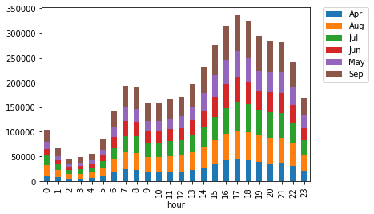


### Heatmap Visualization of Hour, Day, Day of Week and Month

Heatmap by Hour and Day.


```python
hour_day = uber_df[['day', 'hour', 'Date.Time']]
hour_day = hour_day.groupby(['day', 'hour']).agg('count')
hour_day = hour_day.pivot_table(index='hour', columns='day', values='Date.Time')

fig, ax = plt.subplots()
sns.heatmap(hour_day)
ax.set(title = 'Heatmap by Hour and Day')
```


    [Text(0.5, 1.0, 'Heatmap by Hour and Day')]


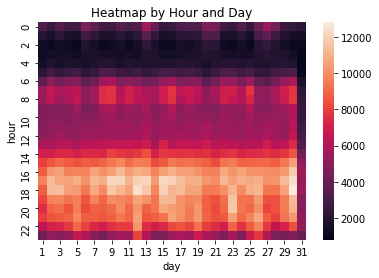


Heatmap by Month and Day.


```python
month_day = uber_df[['day', 'month', 'Date.Time']]
month_day = month_day.groupby(['day', 'month']).agg('count')
month_day = month_day.pivot_table(index='month', columns='day', values='Date.Time')

fig, ax = plt.subplots()
sns.heatmap(month_day)
ax.set(title = 'Heatmap by Month and Day')
```


    [Text(0.5, 1.0, 'Heatmap by Month and Day')]


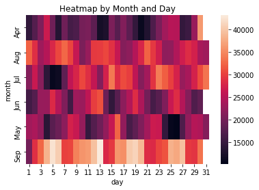


Heatmap by Month and Day of the Week.


```python
fig, ax = plt.subplots()
sns.heatmap(week_month)
ax.set(title = 'Heatmap by Month and Day of the Week')
```


    [Text(0.5, 1.0, 'Heatmap by Month and Day of the Week')]


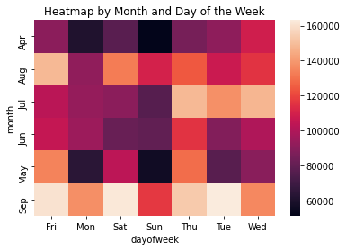


Heatmap by Hour and Month.


```python
fig, ax = plt.subplots()
sns.heatmap(hour_month)
ax.set(title = 'Heatmap by Hour and Month')
```


    [Text(0.5, 1.0, 'Heatmap by Hour and Month')]


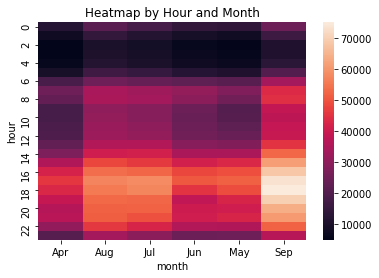

